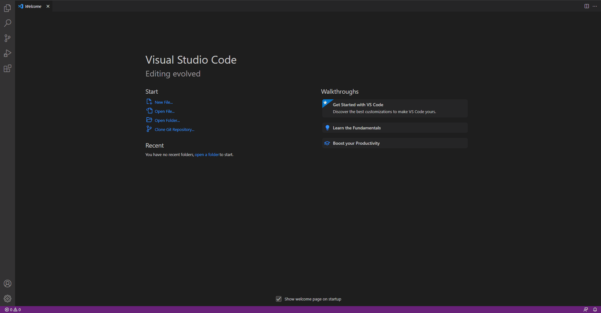
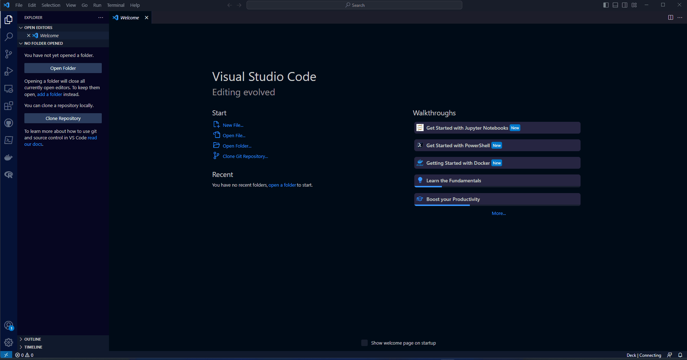
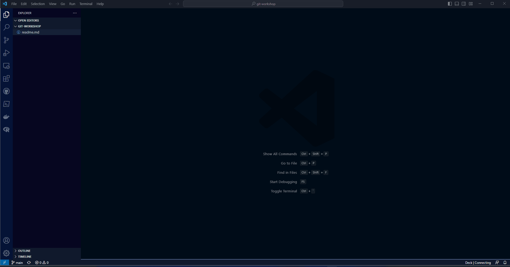
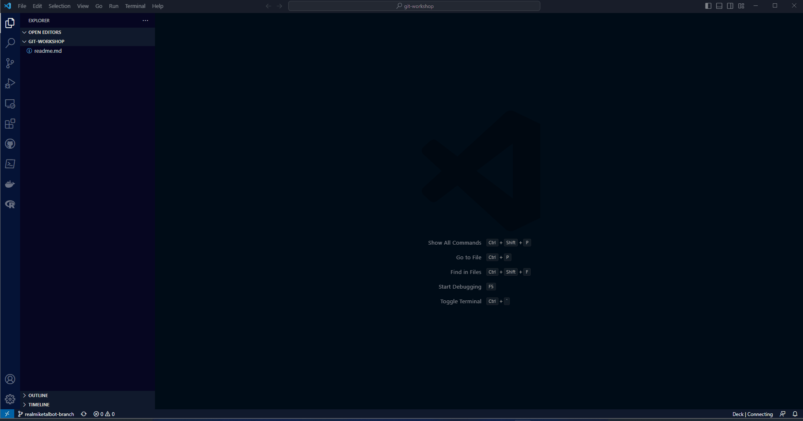
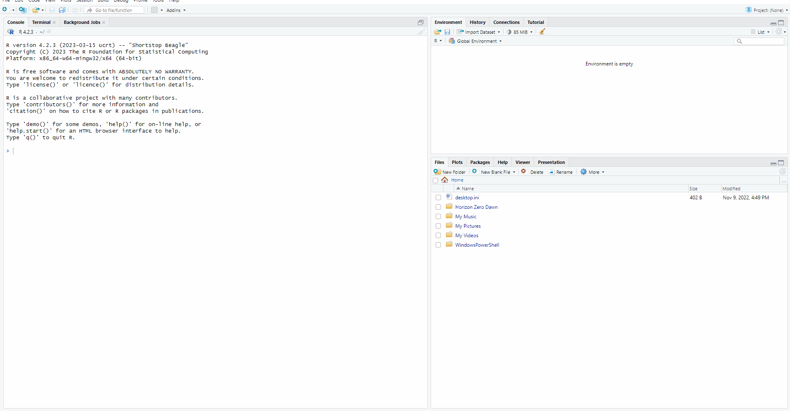

```{r xaringan-themer, include=FALSE, warning=FALSE}
library(xaringanthemer)
style_mono_light(
  base_color = "#00264c",
  header_font_google = google_font("Arial"),
  text_font_google   = google_font("Montserrat", "300", "300i"),
  code_font_google   = google_font("Fira Mono"),
  link_color = "#18bc9c"
)
```

layout: true

background-image: url(https://cdn.jsdelivr.net/gh/eorinc/assets/logos/horizontal_bluegrey_trans.png)
background-position: 93% 9%
background-size: 200px

<div class="my-header"></div>

<div class="my-footer">
  <span class="xaringan">Made using <a href="https://cran.r-project.org/web/packages/xaringan/index.html">Xaringan: Presentation Ninja</a></span>
  <span class="company"><a href="https://eorinc.com">Emmons & Olivier Resources, Inc.</a></span>
</div> 

---

# Why use Git?

- Unlike generic cloud storage (e.g., OneDrive), Git is designed for code

--

- Archive your code in a logical, centralized location ("repository")

--

- Code is often unfinished but unlike, say, a Word document, code can break

--

- Keep a record of all your changes

--

- Work collaboratively with structure

--

- Visual diffs

```diff
function () {
-     Original code
+     Modified code
}
```

---

# Git terminology
<div align="center">
  
</div>

---

# How Git works
<div align="center">
  <a href="https://www.nobledesktop.com/blog/what-is-git-and-why-should-you-use-it" target="_blank">
    
  </a>
</div>

.footnote[
  Source: [What Is Git & Why Should You Use It?](https://www.nobledesktop.com/blog/what-is-git-and-why-should-you-use-it) [accessed 2023-03-17]
]

---

# How GitHub works

- Many options for code sharing (GitHub, GitLab, BitBucket...)

--

- LOTS of features

--

- At a basic level (for our purposes), it hosts a shared/central repository

--

- You "clone" GitHub's version of the repository locally, then "push" your changes back to it

--

- In between, you "pull" subsequent changes from GitHub's repository to your local repository

--

- ...and "commit" individual changes to your local repository

--

- Allows the shared and local repositories to be used completely independently

---

# How Git works
<div align="center">
  <a href="https://www.nobledesktop.com/blog/what-is-git-and-why-should-you-use-it" target="_blank">
    
  </a>
</div>

.footnote[
  Source: [What Is Git & Why Should You Use It?](https://www.nobledesktop.com/blog/what-is-git-and-why-should-you-use-it) [accessed 2023-03-17]
]

---

# How Git works
<div align="center">
  <a href="https://dev.to/sublimegeek/git-staging-area-explained-like-im-five-1anh" target="_blank">
    
  </a>
</div>

.footnote[
  Source: [Git Staging Area: Explained Like I'm Five](https://dev.to/sublimegeek/git-staging-area-explained-like-im-five-1anh) [accessed 2023-03-17]
]

---

# Prerequisites

|                                   |                                           |
|-----------------------------------|------------------------------------       |
|1. Create a GitHub account         | [GitHub](https://github.com)          |
|2. Install Git                     | `choco install git`                       |
|3. Install Visual Studio Code      | `choco install vscode`                    |
|4. Install R                       | `choco install r.project`                 |
|5. Install RStudio                 | `choco install r.studio`                   |
|6. Configure Git                   | [Wiki](https://eorinc.io/wiki/index.php?title=Git#Setup)   |

---

# Configuring VSCode

Configure Settings Sync

<div align="center">
  
</div>

---

# Configuring VSCode

<div align="center">
  
</div>

---

# Configuring VSCode

Clone the repository `eorinc/git-workshop`

<div align="center">
  
</div>


---

# Some basic VSCode/Git actions

- Create a new file called `<your-username>-test.txt` and add some text to it

--

- Stage and commit your changes (to your local repository)

--

- Push your change (to GitHub)

--

- Error message? Pull subsequent changes, then push again!

--

- Merge conflict? Did you use your username in the file name?

---

# Let's cause conflict

- Add some text to the file called `merge-conflicts.txt`

--

- Stage and commit your changes, then push

--

- What happened?

---

# Enter branching

- Imagine this as a script, rather than a text file

--

- Minor/unfinished changes will break the code... for you and others

--

- Use a branch to isolate your code until you're ready to merge it with other changes

--

- Create a distinct branch for a separate feature or issue

---

# Creating a branch

Create a new (unique!) branch

<div align="center">
  
</div>

---

# Adding a change to your branch

- Add some text to the file called `branched-commits.txt`

--

- Stage and commit your changes, then push

--

- Pull subsequent changes

--

- You shouldn't see anyone else changes... unless you switch to their branch

---

# Creating a Pull Request

- Create a PR from your branch into the `main` branch

<div align="center">
  
</div>

--

# Merging a Pull Request

Mike will demonstrate merging a PR

---

# Poking around GitHub

- Look at the code

--

- Look at Commits

--

- Look at Branches

--

- Look at Pull Requests

--

- Submit an issue

---

# Let's pause

Questions?

<div align="center">
  
</div>

---

# Configuring RStudio

Clone the repo `https://github.com/eorinc/git-workshop`

<div align="center">
  
</div>

---

# Using RStudio with Git

- Notice the `Git` tab

--

- Staging is done via checkboxes

--

- Commit, Push, Pull, New Branch... all via buttons

--

- Notice the `.gitignore` file - open it up and let's discuss

---

# Some basic RStudio/Git actions

Create a new script called `<your-username>-script.R`

````markdown
library(ggplot2)
library(plotly)
library(gapminder)

p <- gapminder %>%
  filter(year==1977) %>%
  ggplot( aes(gdpPercap, lifeExp, size = pop, color=continent)) +
  geom_point() +
  theme_bw()

ggplotly(p)
````

---

# Cool stuff

<div align="center">
```{r tidy=TRUE, echo=FALSE, warning=FALSE, message=FALSE, out.width="80%"}
library(ggplot2)
library(plotly)
library(gapminder)

p <- gapminder %>%
  filter(year==1977) %>%
  ggplot( aes(gdpPercap, lifeExp, size = pop, color=continent)) +
  geom_point() +
  theme_bw()

ggplotly(p)
```
</div>

---

# Some basic RStudio/Git actions

- Stage and commit your changes

--

- Pull subsequent changes

--

- Push changes

--

- Pull again...

--

- Create a branch

---

# Are we having fun yet?

<div align="center">
  
</div>

---

# Playing around

i.e., I have nothing else planned